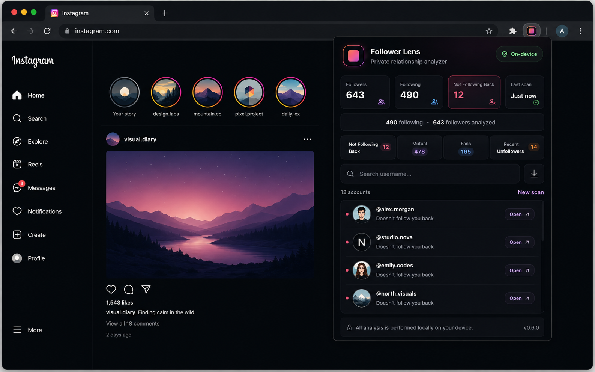

# Follower Lens

A privacy-focused Chrome extension for analyzing Instagram follower relationships directly in your browser.

Follower Lens helps you understand who does not follow you back, who you follow mutually, who follows you without being followed back, and who recently unfollowed you.

## Preview

<p align="center">
  
</p>

## Features

- Live Instagram relationship analysis
- Not Following Back
- Mutual follows
- Fans
- Recent Unfollowers
- Two-scan verification for recent unfollow detection
- Profile pictures and direct profile links
- Search across results
- TXT export
- JSON File Mode as an alternative to live scanning
- On-device history storage
- Conservative request pacing and retry handling
- No password collection
- No external backend
- No third-party analytics

## How It Works

Follower Lens runs as a Chrome extension and uses your existing Instagram browser session.

In Live Mode, the extension reads the follower and following data available to your currently signed-in Instagram account. Relationship analysis is performed locally inside the extension.

The extension does not ask for your Instagram password and does not send your follower data to an external Follower Lens server.

### Relationship Categories

| Category | Meaning |
| --- | --- |
| Not Following Back | Accounts you follow that do not follow you |
| Mutual | Accounts where both sides follow each other |
| Fans | Accounts that follow you but you do not follow |
| Recent Unfollowers | Accounts confirmed as having disappeared from your follower list |

## Recent Unfollowers

Follower Lens uses a confirmation step to reduce false positives.

If an account disappears from one follower scan, it is first marked as pending. It is only added to Recent Unfollowers if it is still missing during a later scan.

This helps avoid incorrectly reporting unfollows when Instagram temporarily omits an account from a response.

## File Mode

Live scanning is not the only option.

Follower Lens can also compare Instagram follower and following JSON files exported from Meta.

This mode is useful when:

- Live scanning is unavailable
- You prefer to work from exported data
- You want a manual fallback

## Privacy

Follower Lens is designed around a simple rule: no unnecessary external data collection.

- No Instagram password is requested
- No Follower Lens backend is used
- No third-party analytics are included
- Relationship analysis runs inside the extension
- Scan history is stored with Chrome local extension storage
- Live requests are sent directly to Instagram using your current browser session

"On-device" refers to Follower Lens processing and storage. Live Mode still communicates with Instagram in order to retrieve account relationship data.

## Installation

### 1. Clone the repository

```bash
git clone https://github.com/ozgeegungordu/follower-lens.git
cd follower-lens
```

### 2. Install dependencies

```bash
npm install
```

### 3. Build the extension

```bash
npm run build
```

### 4. Load it in Chrome

Open:

```text
chrome://extensions
```

Then:

1. Enable **Developer mode**
2. Click **Load unpacked**
3. Select the generated `dist` folder
4. Open Instagram and sign in
5. Open Follower Lens from the Chrome extensions menu

## Development

Start the Vite development environment:

```bash
npm run dev
```

Create a production build:

```bash
npm run build
```

## Project Structure

```text
src/
├── history/
│   ├── followerHistory.ts
│   └── historyTime.ts
├── live/
│   ├── instagramFollowersScanner.ts
│   ├── instagramScanner.ts
│   ├── instagramTypes.ts
│   ├── rateLimiter.ts
│   └── relationshipAnalysis.ts
├── App.tsx
└── main.tsx
```

## Live Scan Design

Follower Lens scans Instagram data page by page with:

- Configurable page sizes
- Delays between requests
- Periodic pauses
- Retry handling for temporary failures
- Deduplication
- Scan diagnostics
- Conservative handling of incomplete relationship information

The extension does not fabricate missing accounts. If Instagram reports a count that differs from the accessible account list, Follower Lens analyzes the accounts it can actually retrieve.

## Current Product Experience

The live dashboard includes:

- Followers count
- Following count
- Not Following Back count
- Last scan time
- Scan summary
- Relationship tabs
- Username search
- Profile avatars
- Direct profile links
- Recent Unfollowers history
- Export support

## Known Limitations

Follower Lens depends on Instagram web behavior and endpoints that may change without notice.

Instagram may occasionally return fewer accessible accounts than the count displayed on a profile. This can happen because of temporary response differences, unavailable accounts, deactivated accounts, or other Instagram-side behavior.

Large accounts may take longer to scan because Follower Lens intentionally avoids extremely aggressive request rates.

## Roadmap

Potential future improvements include:

- Better scan progress feedback
- More detailed scan diagnostics
- Optional scan speed profiles
- Improved history management
- Additional export formats
- Chrome Web Store packaging
- Automated tests for relationship analysis and history logic

## Disclaimer

Follower Lens is an independent project and is not affiliated with, endorsed by, or sponsored by Instagram or Meta.

Use the extension responsibly. Instagram may change its website, APIs, rate limits, or account access behavior at any time.
